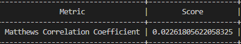
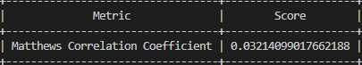

# PANlab

## Covid-twitter-Bert

### Running
```bash
python3 baseline_english_binary_class.py
```
### Output for CT-Bert

- Also the output is english_bin_class_results.csv, which is a csv with text,predicted label, true label, and correctness

## twitter-xlm-roberta-base-sentiment

### Running
```bash
python3 baseline_spanish_binary_class.py
```
### Output for twitter-xlm-roberta

- Also the output is english_bin_class_results.csv, which is a csv with, text, predicted label, true label, and correctness

## bert-base-multilingual-uncased

### Running 
#### English corpus
```bash
python3 baseline_for_multi_task_en_and_es.py annotationsEn.csv
```
#### Spanish corpus
```bash
python3 baseline_for_multi_task_en_and_es.py annotationEs.csv
```
### Output
- Current output show wrong result, and all F1 scores are 0.

