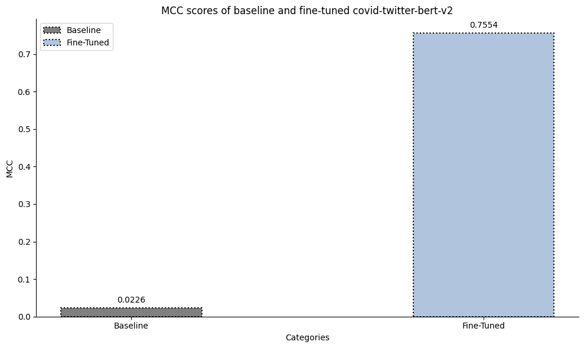
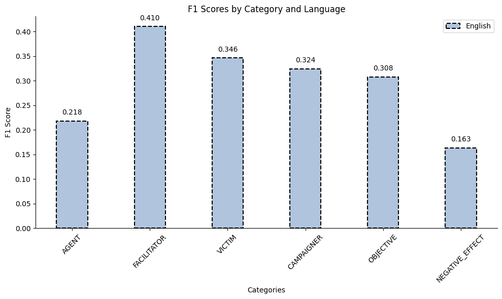
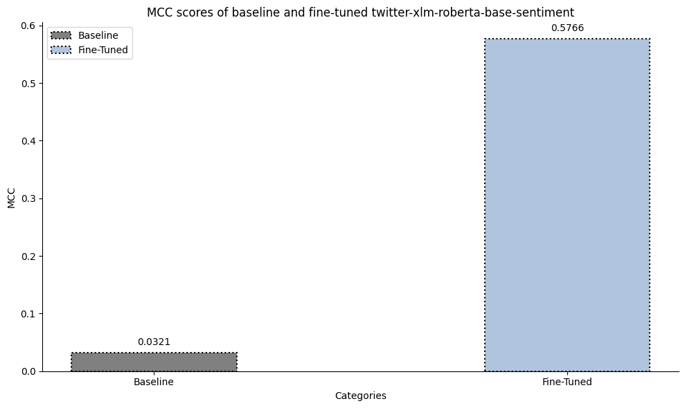
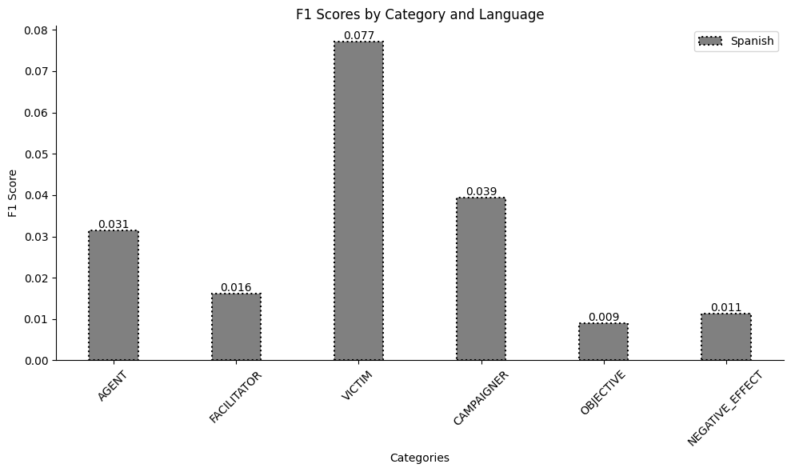

# PANlab

## Models for English dataset
### Model for binary classification
- covid-twitter-bert-v2
#### Idea and challenges
- The idea was to fine-tune the model with the split data
- 80% training, 10% validation, and 10% test data
- Early stoppings are implemented into the model, and it has a patience level of 3. The best model is saved
#### Usage
```bash
python3  Binary-classification/english_model.py
```
#### Comparison of baseline and fine-tuned
| Model | MCC |
--------|------
| Baseline | 0.0226 |
| Fine-Tuned | 0.7554 |
#### Chart

### Model for named entity recognition (NER)
- Meta-Llama-3-8B-Instruct
#### Idea and challenges
- Trying to get the best results with prompt engineering
- I think the F1 score is not a fair representation of the model's accuracy
- The current prompt implemented is the one that performed the best
#### Usage
```bash 
python3 NER-Llama/models/Llama3_ner_en.py
```
- After the model is finished, run this command
```bash
python3 NER-Llama/eval/cosines.py en
```
- To evaluate your model, run
```bash
python3 NER-Llama/eval/evaluate.py en
```
#### Results of NER
| Categories | AGENT | FACILITATOR | VICTIM | CAMPAIGNER | OBJECTIVE | NEGATIVE_EFFECT|
|------------|-------|-------------|--------|------------|-----------|----------------|
|F1 scores | 0.2177 | 0.4101 | 0.3462 | 0.3237 | 0.3076 | 0.1633 | 
#### Chart

## Models for Spanish dataset
### Model for binary classification
- twitter-xlm-roberta-base-sentiment
#### Idea and challenges
- This model was the best one, considering the options
- It is pre-trained on Twitter data, and it's a cross-lingual model
- It performs just a little bit better than random guessing
#### Usage 
```bash
python3 Binary-classification/spanish_model.py
```
#### Comparison of baseline and fine-tuned
| Model | MCC |
--------|------
| Baseline | 0.0321 |
| Fine-Tuned | 0.5766 |
#### Chart

### Model for named entity reecognition (NER)
- Meta-Llama-3-8B-Instruct
#### Idea, and challenges
- This was probably the hardest subtask
- It underperformed because of the several factors
- The next idea is to translate the data into English and evaluate it
#### Usage
```bash 
python3 NER-Llama/models/Llama3_ner_es.py
```
- After the model is finished run this command
```bash
python3 NER-Llama/eval/cosines.py es
```
- To evaluate your model run
```bash
python3 NER-Llama/eval/evaluate.py es
```
#### Results of NER
| Categories | AGENT | FACILITATOR | VICTIM | CAMPAIGNER | OBJECTIVE | NEGATIVE_EFFECT|
|------------|-------|-------------|--------|------------|-----------|----------------|
|F1 scores | 0.0314 | 0.0161 | 0.0771 | 0.0393 | 0.0089 | 0.0112 | 
#### Chart

